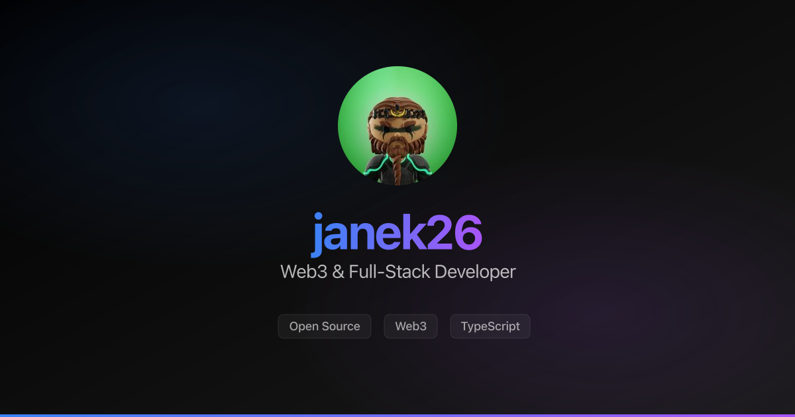

# rahrt.me

> Personal portfolio website built with Next.js, TypeScript, and Tailwind CSS



[](https://github.com/janek26/rahrt/actions/workflows/ci.yml)

A modern, responsive portfolio website featuring smooth animations, dark/light theme support, and optimized static export.

## Features

- ⚡ **Static Export** - Fully static site generation for fast loading
- 🎨 **Theme Support** - Dark and light mode with system preference detection
- ✨ **Smooth Animations** - Framer Motion powered interactions
- 📱 **Responsive** - Mobile-first design that works on all devices
- 🖼️ **Optimized Images** - Automatic WebP generation with fallbacks
- 🎯 **Type Safe** - Full TypeScript support
- 🧹 **Clean Code** - DRY principles with shared utilities and components

## Tech Stack

- [Next.js 16](https://nextjs.org/) - React framework
- [TypeScript](https://www.typescriptlang.org/) - Type safety
- [Tailwind CSS v4](https://tailwindcss.com/) - Styling
- [Framer Motion](https://www.framer.com/motion/) - Animations
- [Bun](https://bun.sh/) - Fast package manager and runtime

## Getting Started

### Prerequisites

- [Bun](https://bun.sh/) (latest version)

### Installation

```bash
# Clone the repository
git clone https://github.com/janek26/rahrt.git
cd rahrt.me

# Install dependencies (automatically generates assets via prepare script)
bun install

# Start development server
bun run dev
```

The `prepare` script automatically runs after installation and generates:

- High-resolution avatar source and optimized web versions
- All favicon variants (circular for browser, square for app icons)
- Open Graph and Twitter preview images

Open [http://localhost:3000](http://localhost:3000) to see the site.

### Build

```bash
# Build static site
bun run build

# Output will be in the `out/` directory
```

## Scripts

- `bun run dev` - Start development server
- `bun run build` - Build static site
- `bun run format` - Format code with Prettier
- `bun run format:check` - Check code formatting
- `bun run prepare` - Generate all assets (runs automatically after `bun install`)
  - Downloads high-resolution avatar from GitHub (512x512)
  - Generates optimized web versions (1x and 2x for retina)
  - Generates all favicon variants (circular for browser, square for app icons)
  - Generates Open Graph and Twitter preview images
  - Generates README header image (docs/header.png)
- `bun run download-avatar` - Download and optimize avatar image
- `bun run generate-favicons` - Generate favicons from avatar source
- `bun run generate-og-images` - Generate Open Graph and Twitter preview images
- `bun run generate-header` - Generate README header image (docs/header.png)

## Project Structure

```
├── app/              # Next.js app directory
├── components/       # React components
│   └── ui/          # Reusable UI components
├── lib/             # Shared utilities and constants
├── public/          # Static assets
│   ├── images/      # Image assets (generated)
│   │   ├── avatar-source.jpg  # High-res source (512x512)
│   │   ├── avatar.jpg         # Optimized 1x (128x128)
│   │   ├── avatar@2x.jpg      # Optimized 2x (256x256)
│   │   └── og-image.png       # Open Graph preview
│   └── icons/       # Favicon and app icons (generated)
├── scripts/         # Build and utility scripts
└── styles/          # Global styles
```

**Note:** Generated files (in `public/images/`, `public/icons/`, `public/favicon.ico`, `public/site.webmanifest`, and `lib/avatar-blur.ts`) are automatically created by the `prepare` script and are ignored by git. The `docs/header.png` file is also generated but is committed to the repository for use in the README.

## Deployment

See [DEPLOYMENT.md](./DEPLOYMENT.md) for detailed deployment instructions.

## License

MIT

## Author

**Janek** - [@0xjanek](https://twitter.com/0xjanek)

---

Built with ❤️ using Next.js
