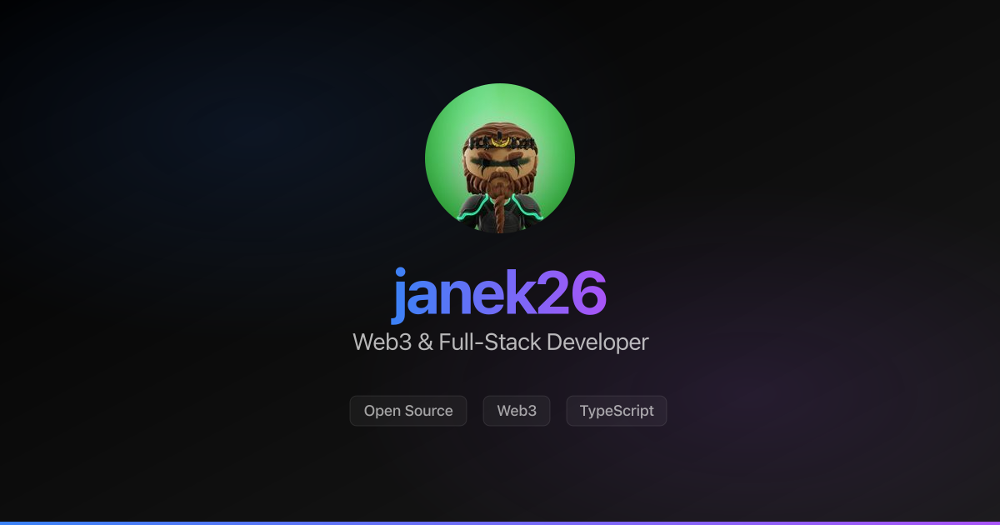

# rahrt.me

> Personal portfolio website built with Next.js, TypeScript, and Tailwind CSS



[](https://github.com/janek26/rahrt/actions/workflows/ci.yml)

A modern, responsive portfolio website featuring smooth animations, dark/light theme support, and optimized static export.

## Features

- ⚡ **Static Export** - Fully static site generation for fast loading
- 🎨 **Theme Support** - Dark and light mode with system preference detection
- ✨ **Smooth Animations** - Framer Motion powered interactions
- 📱 **Responsive** - Mobile-first design that works on all devices
- 🖼️ **Optimized Images** - Automatic WebP generation with fallbacks
- 🎯 **Type Safe** - Full TypeScript support
- 🧹 **Clean Code** - DRY principles with shared utilities and components

## Tech Stack

- [Next.js 16](https://nextjs.org/) - React framework
- [TypeScript](https://www.typescriptlang.org/) - Type safety
- [Tailwind CSS v4](https://tailwindcss.com/) - Styling
- [Framer Motion](https://www.framer.com/motion/) - Animations
- [Bun](https://bun.sh/) - Fast package manager and runtime
- [MCP Framework](https://www.mcp-framework.com/) - TypeScript Model Context Protocol server
- [Resend](https://resend.com/) - Email delivery for MCP contact requests

## Getting Started

### Prerequisites

- [Bun](https://bun.sh/) (latest version)

### Installation

```bash
# Clone the repository
git clone https://github.com/janek26/rahrt.git
cd rahrt.me

# Install dependencies (automatically generates assets via prepare script)
bun install

# Start development server
bun run dev
```

The `prepare` script automatically runs after installation and generates:

- High-resolution avatar source and optimized web versions
- All favicon variants (circular for browser, square for app icons)
- Open Graph and Twitter preview images

Open [http://localhost:3000](http://localhost:3000) to see the site.

### Build

```bash
# Build static site
bun run build

# Output will be in the `out/` directory
```

## Scripts

- `bun run dev` - Start development server
- `bun run build` - Build static site
- `bun run format` - Format code with Prettier
- `bun run format:check` - Check code formatting
- `bun run prepare` - Generate all assets (runs automatically after `bun install`)
  - Downloads high-resolution avatar from GitHub (512x512)
  - Generates optimized web versions (1x and 2x for retina)
  - Generates all favicon variants (circular for browser, square for app icons)
  - Generates Open Graph and Twitter preview images
  - Generates README header image (docs/header.png)
- `bun run download-avatar` - Download and optimize avatar image
- `bun run generate-favicons` - Generate favicons from avatar source
- `bun run generate-og-images` - Generate Open Graph and Twitter preview images
- `bun run generate-header` - Generate README header image (docs/header.png)
- `bun run mcp:build` - Compile and validate the portfolio MCP server
- `bun run mcp:stdio` - Run the MCP server locally over stdio
- `bun run mcp:http` - Run the MCP server over HTTP Stream for hosted MCP clients
- `bun run mcp:start` - Run the compiled MCP server from `mcp-server/dist`

## Portfolio MCP Server

This repository includes a TypeScript MCP server that lets AI tools explore my
portfolio as structured context and, when configured, contact me through Resend.

### Capabilities

- Tools:
  - `get_profile` - profile, availability, links, focus areas, and proof points
  - `get_experience` - filterable career history and impact bullets
  - `get_projects` - featured and open-source project lookup
  - `get_cv` - structured or markdown CV
  - `match_opportunity` - role/project matching with evidence and follow-up questions
  - `contact_janek` - sends a Resend email for serious, user-approved outreach
- Resources:
  - `portfolio://profile`
  - `portfolio://cv`
  - `portfolio://projects`
  - `portfolio://contact`
- Prompts:
  - `evaluate_janek_for_role`
  - `draft_outreach_to_janek`

### Local setup for AI tools

Build the server first:

```bash
bun install
bun run mcp:build
```

Use the absolute path to this checkout in your MCP client config.

#### Claude Code

```bash
claude mcp add janek-portfolio -- bun /absolute/path/to/rahrt.me/mcp-server/dist/index.js
```

With contact email delivery enabled:

```bash
claude mcp add janek-portfolio \
  -e RESEND_API_KEY=re_xxxxx \
  -e RESEND_FROM_EMAIL="Janek MCP <mcp@your-verified-domain.com>" \
  -e MCP_CONTACT_TO_EMAIL=hello@rahrt.me \
  -- bun /absolute/path/to/rahrt.me/mcp-server/dist/index.js
```

#### Claude Desktop / Cursor-style JSON config

```json
{
  "mcpServers": {
    "janek-portfolio": {
      "command": "bun",
      "args": ["/absolute/path/to/rahrt.me/mcp-server/dist/index.js"],
      "env": {
        "RESEND_API_KEY": "re_xxxxx",
        "RESEND_FROM_EMAIL": "Janek MCP <mcp@your-verified-domain.com>",
        "MCP_CONTACT_TO_EMAIL": "hello@rahrt.me"
      }
    }
  }
}
```

#### opencode

Add the server as a local MCP command:

```json
{
  "mcp": {
    "janek-portfolio": {
      "type": "local",
      "command": ["bun", "/absolute/path/to/rahrt.me/mcp-server/dist/index.js"],
      "environment": {
        "RESEND_API_KEY": "re_xxxxx",
        "RESEND_FROM_EMAIL": "Janek MCP <mcp@your-verified-domain.com>",
        "MCP_CONTACT_TO_EMAIL": "hello@rahrt.me"
      }
    }
  }
}
```

If a client supports remote Streamable HTTP MCP servers, run the server with
`MCP_TRANSPORT=http` and connect it to `https://your-host.example/mcp`.

### Hosted setup (Railway MCP URL)

Use this hosted MCP endpoint:

- `https://rahrt-portfolio-mcp-production.up.railway.app/mcp`

#### Cursor (remote MCP)

Add to `.cursor/mcp.json` (project) or `~/.cursor/mcp.json` (global):

```json
{
  "mcpServers": {
    "janek-portfolio": {
      "url": "https://rahrt-portfolio-mcp-production.up.railway.app/mcp"
    }
  }
}
```

With API key auth enabled on the server:

```json
{
  "mcpServers": {
    "janek-portfolio": {
      "url": "https://rahrt-portfolio-mcp-production.up.railway.app/mcp",
      "headers": {
        "x-api-key": "${env:MCP_API_KEY}"
      }
    }
  }
}
```

#### OpenCode (remote MCP)

Add to `opencode.json`:

```json
{
  "$schema": "https://opencode.ai/config.json",
  "mcp": {
    "janek-portfolio": {
      "type": "remote",
      "url": "https://rahrt-portfolio-mcp-production.up.railway.app/mcp",
      "enabled": true
    }
  }
}
```

With API key auth:

```json
{
  "$schema": "https://opencode.ai/config.json",
  "mcp": {
    "janek-portfolio": {
      "type": "remote",
      "url": "https://rahrt-portfolio-mcp-production.up.railway.app/mcp",
      "enabled": true,
      "oauth": false,
      "headers": {
        "x-api-key": "{env:MCP_API_KEY}"
      }
    }
  }
}
```

#### Claude Code (via `mcp-remote`)

```bash
claude mcp add janek-portfolio -- npx -y mcp-remote https://rahrt-portfolio-mcp-production.up.railway.app/mcp
```

#### Claude Desktop (via `mcp-remote`)

Add to `claude_desktop_config.json`:

```json
{
  "mcpServers": {
    "janek-portfolio": {
      "command": "npx",
      "args": [
        "-y",
        "mcp-remote",
        "https://rahrt-portfolio-mcp-production.up.railway.app/mcp"
      ]
    }
  }
}
```

#### VS Code extensions (Cline / Roo Code style)

Use a stdio bridge command:

```json
{
  "mcpServers": {
    "janek-portfolio": {
      "command": "npx",
      "args": [
        "-y",
        "mcp-remote",
        "https://rahrt-portfolio-mcp-production.up.railway.app/mcp"
      ]
    }
  }
}
```

For additional deployment and client setup details, see
[deploy.md](./deploy.md).

## Project Structure

```
├── app/              # Next.js app directory
├── components/       # React components
│   └── ui/          # Reusable UI components
├── lib/             # Shared utilities and constants
├── mcp-server/      # Bun/TypeScript MCP server for AI tools
├── public/          # Static assets
│   ├── images/      # Image assets (generated)
│   │   ├── avatar-source.jpg  # High-res source (512x512)
│   │   ├── avatar.jpg         # Optimized 1x (128x128)
│   │   ├── avatar@2x.jpg      # Optimized 2x (256x256)
│   │   └── og-image.png       # Open Graph preview
│   └── icons/       # Favicon and app icons (generated)
├── scripts/         # Build and utility scripts
└── styles/          # Global styles
```

**Note:** Generated files (in `public/images/`, `public/icons/`, `public/favicon.ico`, `public/site.webmanifest`, and `lib/avatar-blur.ts`) are automatically created by the `prepare` script and are ignored by git. The `docs/header.png` file is also generated but is committed to the repository for use in the README.

## Deployment

See [DEPLOYMENT.md](./DEPLOYMENT.md) for detailed deployment instructions.
See [deploy.md](./deploy.md) for MCP server hosting with Docker, Railway, or a generic server.

## License

MIT

## Author

**Janek** - [@0xjanek](https://twitter.com/0xjanek)

---

Built with ❤️ using Next.js
